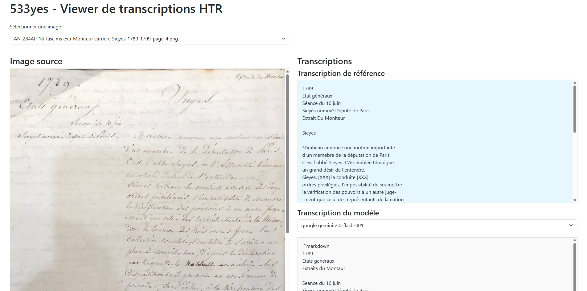

# 533yes ("See-yes")

533yes est un benchmark qualitatif rapide pour comparer la performance des systèmes d'IA multimodaux sur la tâche HTR (Handwritten Text Recognition) avec des approches plus anciennes (apprentissage machine) sur un échantillon de documents manuscrits de et sur Emmanuel-Joseph Sieyès. C'est une petite étape sur la voie d'un projet plus large, *IAg Révolution*. Les images retenues présentent un éventail des difficultés contenues dans le corpus cible.

**Attention:** en l'état actuel des choses **les hallucinations restent très nombreuses** pour tous les modèles d'IA appliqués à l'HTR. Une grande vigilance est nécessaire en fonction du type de tâches envisagées en aval. L'objectif en ce qui nous concerne n'est pas d'obtenir une transcription complète ou même parfaitement exacte, le texte HTR n'ayant pas vocation à être communiqué à l'utilisateur final, mais de restituer la plus grande partie possible du contenu sémantique des documents pour les rendre indexables par un moteur de recherche vectoriel. Dans une dernière étape, nous testerons si le niveau de bruit engendré par les erreurs de HTR, hallucinations comprises, reste acceptable ou non.

## Résultats principaux

Les résultats complets de notre benchmark sont disponibles dans ce dépôt. Voici les points clés :

- **26 modèles évalués** : Incluant des modèles propriétaires (OpenAI, Google, Anthropic, X-AI, Amazon) et libres (Mistral, Meta-Llama, Qwen, Kraken)
- **15 images de test** : Documents manuscrits d'Emmanuel-Joseph Sieyès et le concernant (XVIIIe siècle) 
- **Meilleure performance** : Les modèles les plus performants sont `openai/gpt-4.5-preview` (WER médian: 0.556), `google/gemini-2.0-flash-thinking-exp:free` (WER médian: 0.694) et `google/gemini-2.0-flash-exp:free` (WER médian: 0.695)
- **Rapport coût/performance** : Les modèles gratuits comme `google/gemini-2.0-flash-thinking-exp:free` et `qwen/qwen2.5-vl-72b-instruct:free` (WER médian: 0.719) offrent un excellent rapport qualité/prix

Pour explorer les résultats en détail :
- Consultez [resultats_summary.md](resultats_summary.md) pour un aperçu global des performances
- Explorez [rapports/performance_par_page.md](rapports/performance_par_page.md) pour les performances détaillées par page
- Utilisez le visualiseur interactif [viewer/htr_viewer.html](viewer/htr_viewer.html) pour comparer les transcriptions
  
  
  
- Lisez l'analyse détaillée dans [rapports/analyse_modeles.md](rapports/analyse_modeles.md)

## Structure du projet

- Les images source sont dans le dossier `/images`
- Les transcriptions de référence sont dans le dossier `/transcriptions_de_référence`
- Les transcriptions des divers systèmes sont dans le dossier `/résultats`
- Les résultats produits par les différents modèles sont dans des fichiers au format `nomimage_fournisseur_modele.md`

## Composants du projet

- `benchmark_htr.ipynb` : Notebook principal pour l'exécution des tests
- `benchmark_kraken.py` : Script pour les tests avec Kraken
- `transkribus_api.py` : Interface avec l'API Transkribus
- `utils.py` : Fonctions utilitaires
- `requirements.txt` : Dépendances du projet
- `viewer/htr_viewer.html` : Interface web pour visualiser et comparer les transcriptions
- `scripts/generate_performance_table.py` : Script pour générer les tableaux de performance

## Objectif

Ce benchmark vise à évaluer et comparer l'efficacité des différentes approches de reconnaissance de texte manuscrit sur des documents historiques.

### Limites de la démarche

- **Uniformité des paramètres** : Pour garantir une comparaison standardisée, le même prompt et la même température sont utilisés pour l'ensemble des modèles. Or, ces paramètres fixes peuvent ne pas être adaptés à la spécificité de chaque modèle, limitant ainsi la possibilité d'optimiser leurs performances individuelles.
- **Taille de l'échantillon** : Le benchmark est limité à 15 images, ce qui peut ne pas être représentatif de tous les types de documents manuscrits.
- **Absence de fine-tuning** : dans le cadre de ce test rapide, aucun fine-tuning n'a été réalisé.
- **Difficulté de déchiffrer certains textes même pour un humain** : L'écriture des brouillons de Sieyes est particulièrement diffcile à lire, ce qui conduit à ce que de nombreux mots soient considérés comme illisibles dans la transcription étalon. 

## Métrique d'évaluation : WER (Word Error Rate)

Le WER (Taux d'Erreur par Mot) est la métrique principale utilisée pour évaluer la performance des systèmes HTR. Il est calculé comme suit :

WER = (S + D + I) / N

Où :
- S = nombre de substitutions (mots incorrectement reconnus)
- D = nombre de suppressions (mots manquants)
- I = nombre d'insertions (mots ajoutés)
- N = nombre total de mots dans la référence

Plus le WER est bas, meilleure est la performance du système. Un WER de 0 signifie une reconnaissance parfaite, tandis qu'un WER de 1 (ou 100%) indique une reconnaissance totalement incorrecte.

## Comment utiliser ce dépôt

1. **Explorer les résultats** : Consultez les fichiers de résultats dans le dossier `/rapports`
2. **Visualiser les comparaisons** : Ouvrez `viewer/htr_viewer.html` dans un navigateur pour une expérience interactive
3. **Reproduire les tests** : Suivez les instructions dans `benchmark_htr.ipynb` pour exécuter vos propres tests

## Licence

Ce projet est sous licence [MIT](LICENSE.md).

